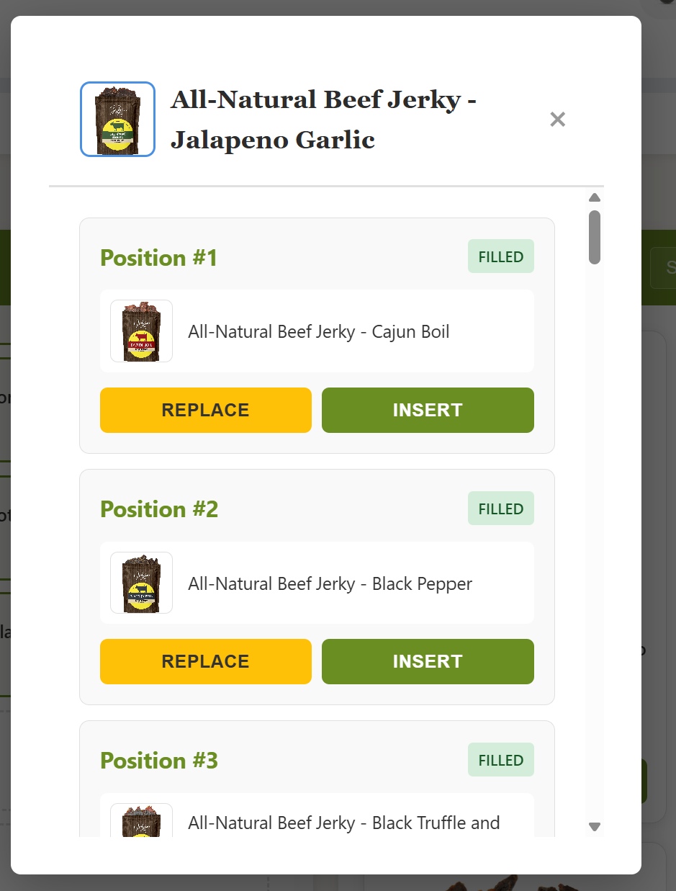

# Rank a Product - Frontend Requirements

## Overview
A product ranking interface that allows users to create and manage their personalized jerky rankings. The feature provides **two interaction modes** for maximum usability:

1. **Desktop Mode**: Drag-and-drop interface with side-by-side panels
2. **Mobile Mode**: Modal-based interface with REPLACE/INSERT buttons


*Example ranking modal showing REPLACE and INSERT options for each position*

---

## Core User Features

### Feature 1: Rank a Product (Modal Interface)

**User Flow:**
1. User clicks "Rank This Product" button on any product card
2. Modal opens showing all current ranking positions
3. User chooses a position and action:
   - **REPLACE**: Swap out the current product at that position
   - **INSERT**: Add product at that position and push others down
4. Modal closes, product list updates automatically
5. Rankings auto-save in background (800ms debounce)

#### Modal Structure

**Modal Container:**
- Width: 95% on mobile, max-width 900px on desktop
- Max-height: 90vh
- Backdrop overlay for focus

**Header:**
- Layout: Flexbox (space-between)
- Product thumbnail: 60x60px, rounded
- Product title: Bold, truncated to ~40 chars
- Close button: × icon

**Body (Scrollable):**
- Scrollable list of all positions
- Overflow-y: Auto

**Position Item:**
- Each position shows:
  - Position number: "Position #1", "Position #2", etc.
  - Status badge: "FILLED" or "EMPTY"
  - Current product (if filled): Thumbnail + name
  - Action buttons: REPLACE and INSERT

**Action Buttons:**
- Min-height: 44px (touch-friendly)
- REPLACE button: Disabled when position is empty
- INSERT button: Always enabled

#### REPLACE Action

**What happens:**
- Overwrites the product at the selected position
- Old product is **removed entirely** from rankings
- No other positions are affected
- Products below stay in place

**Example:**
```
Before REPLACE at Position #2:
  1. Cajun Boil
  2. Black Pepper  ← User replaces this
  3. Black Truffle

After REPLACE with "Jalapeno Garlic":
  1. Cajun Boil
  2. Jalapeno Garlic  ← New product
  3. Black Truffle

Note: "Black Pepper" is gone (not returned to available products)
```

#### INSERT Action

**What happens:**
- Adds new product at the selected position
- If position is filled: displaced product returns to available list
- All products at/below that position shift down by 1
- Ranking slots expand automatically if needed

**Example:**
```
Before INSERT at Position #2:
  1. Cajun Boil
  2. Black Pepper
  3. Black Truffle

After INSERT "Jalapeno Garlic" at Position #2:
  1. Cajun Boil
  2. Jalapeno Garlic  ← Inserted
  3. Black Pepper     ← Pushed from #2 to #3
  4. Black Truffle    ← Pushed from #3 to #4

Note: If #2 was filled, "Black Pepper" returns to available products
```

#### Modal Interactions

**Button States:**
- REPLACE: 
  - Enabled on filled slots
  - Disabled on empty slots (opacity reduced, not-allowed cursor)
- INSERT: 
  - Always enabled
  - No disabled state

**Close Methods:**
- Click × button
- Press ESC key
- Click outside modal
- Automatic close after REPLACE/INSERT

**Keyboard:**
- ESC closes modal
- Tab navigates buttons
- Enter/Space activates buttons

**Responsive:**
- Mobile (<768px): 
  - Modal width: 95%
  - Buttons stack vertically (full width)
  - Min touch target: 44px height
  - Padding: 16px
  - Font sizes: Slightly smaller for compact display
- Desktop (≥768px): 
  - Modal max-width: 900px
  - Buttons side-by-side (equal width)
  - Padding: 24px
  - Hover states visible

---

### Feature 2: Rank a Product (Drag & Drop)

**User Flow:**
1. User drags product card from search panel
2. Drops on a ranking slot (empty or filled)
3. Drop behavior same as INSERT action (push-down)
4. Rankings auto-save in background

**Visual Feedback:**
- Dragging: Product card shows drag cursor
- Drag over slot: Slot highlights with blue border
- Drop: Slot fills immediately (optimistic UI)

**Drag Sources:**
- Product cards in search panel
- Existing ranking slots (reorder)

**Drop Targets:**
- Any ranking slot (1 through N)
- Dropping on filled slot behaves like INSERT

---

### Feature 3: Manage Your Rankings

**Panel Header**
- Title: "🏆 Your Rankings"
- Action buttons: Toggle collapse, Clear All

**Panel Sub-Header (Progress Indicator)**
- Layout: Flex column with gap (stacks progress text and progress bar vertically)

**Progress Info Row:**
- Format: "X of Y ranked (Z%)"
- Example: "5 of 150 ranked (3%)"
- Updates in real-time as user ranks products

**Progress Bar:**
- Visual bar showing completion percentage
- Width: Animates from 0-100% based on percentage
- Smooth transition animation

**Calculation:**
- Ranked count: Number of filled slots
- Total count: Total products available to user
- Percentage: (ranked / total) × 100

**View Current Rankings**
- Numbered slots below sub-header (1, 2, 3...)
- Initial slots: 10
- Auto-expands: +5 slots when filling within 2 of max
- Each filled slot shows:
  - Product thumbnail
  - Product title
  - Vendor name
  - Remove button (×)

**Remove a Product**
- Click × button on any filled slot
- Product removed immediately
- Remaining products renumber automatically
- Removed product does NOT return to available list

**Clear All Rankings**
- Button in panel header
- Confirmation dialog: "Are you sure?"
- Clears all rankings via API call
- Progress widget updates automatically

**Save Status Indicator**
- Shows in rankings panel header
- States: idle | saving | saved | error
- "Saving...": Spinner + text
- "✓ Saved": Checkmark + text (2 seconds)
- "❌ Error": Error message

---

### Feature 4: Search & Browse Products

**Panel Header**
- Title: "🔍 Search Products"
- Search controls: Input field + Search button

**Panel Sub-Header (Available Count)**
- Layout: Flex with space-between alignment

**Available Count Text:**
- Format: "X available to rank"
- Example: "145 available to rank"
- Updates dynamically when products ranked/removed
- Positioned on the left

**Helper Text:**
- Text: "← Drag products to rank"
- Desktop only (hide on mobile <768px)
- Positioned on the right

**Search Interface**
- Search input with icon
- Placeholder: "Search products by name, animal, flavor..."
- Real-time search with 300ms debounce
- Clear search shows all available products

**Product List**
- Grid layout with product cards
- Each card shows:
  - Product image (or placeholder)
  - Product title
  - Vendor name
  - Metadata tags (animal, flavor)
  - "Rank This Product" button
  - Draggable (desktop)

**Pagination**
- Load 20 products at a time
- "Load More Products" button at bottom
- Shows "X of Y loaded"
- Button disabled during loading
- Loading spinner on button

**Empty States**
- No search results: "No products match your search" + 🔍
- All ranked: "All products have been ranked!" + 🔍

**Available Count**
- Header shows: "150 available to rank"
- Updates as products are ranked

---

### Feature 5: Progress & Achievements

**Progress Widget (Collapsible)**
- Location: Top of rank page
- Collapsed by default (stored in sessionStorage)
- Click to expand/collapse

**Compact View (Collapsed)**
- Recent achievement icon
- Total products ranked: 🎯 25
- Current streak: 🔥 7
- Next milestone progress bar with %

**Expanded View**
- All achievements grid (earned + locked)
- Earned: Full name + tier emoji (🥉🥈🥇)
- Locked: "???" + cryptic hint
- Click achievement → Navigate to Coin Book

**Next Milestone**
- Shows upcoming achievement name
- Mysterious description (e.g., "The path reveals itself...")
- Progress bar (0-100%)

**Progress Hints for Locked Achievements:**
- rank_count: "Progress: 10/25"
- streak_days: "Current streak: 3/7 days"
- unique_brands: "Brands explored: 5/10"
- leaderboard_position: "Rank higher to unlock..."
- profile_views: "Views: 50/100"
- trendsetter: "Rank trending products..."

**Data Refresh:**
- Auto-refresh every 60 seconds
- Manual refresh on ranking changes
- 30 second cache

---

### Feature 6: Auto-Save System

**How It Works:**
1. User makes any ranking change
2. 800ms debounce timer starts
3. After 800ms: Save queued to IndexedDB
4. Network request sent to server
5. On success: Mark operation complete, remove from queue
6. On failure: Retry with exponential backoff (3 attempts max)

**Persistent Queue (IndexedDB)**
- Survives page refresh, browser crash, network outages
- Stores operations with:
  - Operation ID (unique)
  - Full rankings payload
  - Idempotency key
  - Retry count
  - Timestamp
- On page load: Resume pending operations automatically

**Retry Logic:**
- Attempt 1: Immediate
- Attempt 2: After 2 seconds
- Attempt 3: After 4 seconds
- After 3 failures: Show persistent error

**Optimistic UI:**
- Changes appear instantly (before save)
- Products removed from available list immediately
- On failure: Restore to available list
- User never blocked by network

---

### Feature 7: Navigation Protection

**Prevent Data Loss:**
- Browser navigation (back/forward): beforeunload warning
- React Router navigation: Block with confirmation modal
- Tab/window close: Browser confirmation dialog

**Navigation Modal:**
- Shows when navigating with pending saves
- "Saving your rankings..."
- Spinner + save status message
- Auto-proceeds when save completes
- Error state if save fails

**What's Protected:**
- Route changes (e.g., Home → Rank → Products)
- Browser back/forward buttons
- Tab close
- Page refresh

---

## UI/UX Requirements

### Layout (Desktop)

```
┌─────────────────────────────────────┐
│  Breadcrumb  |  Browse All Button   │
├─────────────────────────────────────┤
│        Progress Widget (collapsible) │
├──────────────────┬──────────────────┤
│                  │                  │
│  Rankings Panel  │  Products Panel  │
│  (Left 40%)      │  (Right 60%)     │
│                  │                  │
│  1. [Product]    │  [Search Input]  │
│  2. [Product]    │                  │
│  3. [Empty]      │  [Product Grid]  │
│  ...             │                  │
│                  │  [Load More]     │
└──────────────────┴──────────────────┘
```

### Loading States

**Initial Page Load:**
- Rankings panel: Empty slots visible
- Products panel: Loading spinner
- Progress widget: Hidden until data loads

**Search:**
- Products panel: Loading spinner overlay
- Search input: Enabled during load
- Product grid: Dims slightly

**Pagination:**
- "Load More" button: Spinner + "Loading..." text
- Button disabled
- Product grid: Stays visible

**Auto-save:**
- Rankings header: Spinner + "Saving..."
- No blocking UI
- Slots remain interactive

### Error States

**Failed Rankings Load:**
- Log error to console
- Show empty rankings panel
- Allow user to start ranking

**Failed Product Load:**
- Error message in products panel
- "Failed to load products"
- Retry button

**Failed Save:**
- Error message in rankings header
- "❌ Save failed after 3 attempts"
- Operation stays in IndexedDB queue
- Retry on next page load

**No Network:**
- Operations queue in IndexedDB
- "Saving offline..." message
- Auto-retry when connection restored

### Animations & Transitions

**Drag & Drop:**
- Smooth transform during drag
- 200ms ease-in-out on drop
- Highlight animation on target slot

**Modal:**
- Fade in: 200ms
- Slide up: 300ms ease-out
- Backdrop fade: 200ms

**Save Status:**
- Spinner rotation: continuous
- Success fade: 2 seconds
- Error shake: 0.5 seconds

**Product Removal:**
- Fade out: 300ms
- Collapse: 200ms ease-in
- Renumber: stagger 100ms each

---

## API Endpoints (Frontend Contracts)

### Save Rankings

```javascript
POST /api/rankings/products

Headers:
  X-Idempotency-Key: {unique-key}
  Cookie: session_id={httpOnly}

Body:
{
  rankingListId: 'default',
  rankings: [
    {
      ranking: 1,
      productData: {
        id: '123',
        title: 'Product Name',
        vendor: 'Brand',
        image: 'https://...',
        // ... other fields
      }
    }
  ]
}

Success Response (200):
{
  success: true,
  message: 'Saved 10 rankings'
}

Error Response (400):
{
  error: 'Duplicate products detected in rankings',
  duplicates: ['123', '456']
}
```

### Get Rankings

```javascript
GET /api/rankings/products?rankingListId=default

Headers:
  Cookie: session_id={httpOnly}

Success Response (200):
{
  rankings: [
    {
      id: 1,
      userId: 123,
      shopifyProductId: '987654321',
      ranking: 1,
      productData: { /* full product */ },
      createdAt: '2025-11-01T...',
      updatedAt: '2025-11-01T...',
      rankingListId: 'default'
    }
  ]
}
```

### Clear Rankings

```javascript
DELETE /api/rankings/products/clear?rankingListId=default

Headers:
  Cookie: session_id={httpOnly}

Success Response (200):
{ success: true }
```

### Get Rankable Products

```javascript
GET /api/products/rankable?query={search}&page={n}&limit=20&sort=name-asc

Headers:
  Cookie: session_id={httpOnly}

Success Response (200):
{
  products: [
    {
      productId: '123',
      title: 'Product Name',
      vendor: 'Brand',
      image: 'https://...',
      price: '29.99',
      metadata: {
        animal: 'beef',
        flavor: 'teriyaki'
      },
      rankingCount: 42,      // How many users ranked this
      avgRank: 3.5,          // Average rank position
      // ... other fields
    }
  ],
  total: 150,              // Total available products
  hasMore: true            // More pages available
}

Notes:
- Server filters out already-ranked products
- Non-employees only see purchased products
- Employees see all products
```

### Get Progress Data

```javascript
GET /api/gamification/progress

Headers:
  Cookie: session_id={httpOnly}

Success Response (200):
{
  totalRankings: 25,
  currentStreak: 7,
  achievements: [
    {
      code: 'first_rank',
      name: 'First Steps',
      description: 'Ranked your first product',
      icon: '🎯',
      tier: 'bronze',
      earned: true,
      earnedDate: '2025-10-15T...',
      requirement: { type: 'rank_count', value: 1 },
      progress: { current: 25, required: 1 }
    }
  ],
  recentAchievements: [ /* last 3 earned */ ],
  nextMilestones: [
    {
      code: 'rank_50',
      name: 'Halfway There',
      progress: 50  // percentage (0-100)
    }
  ]
}
```

---

## Frontend State Management

### useRankings Hook

**State:**
- `rankings`: Array of ranking objects
- `saveStatus`: 'idle' | 'saving' | 'saved' | 'error'
- `saveMessage`: String for UI display
- `hasPendingSaves`: Boolean flag

**Methods:**
- `loadRankings()`: Fetch from API
- `updateRankings(newRankings)`: Update state + trigger auto-save
- `clearAllRankings()`: DELETE API call
- `waitForPendingSaves()`: Promise that resolves when queue empty

**Auto-save Flow:**
1. updateRankings() called
2. State updates immediately (optimistic)
3. 800ms debounce timer set
4. Timer expires → enqueue to IndexedDB
5. POST to /api/rankings/products
6. Success → remove from queue, invalidate caches
7. Failure → retry with backoff

### useRankableProducts Hook

**State:**
- `products`: Array of product objects
- `loading`: Boolean
- `searchTerm`: String
- `currentPage`: Number
- `hasMore`: Boolean
- `totalProducts`: Number
- `availableCount`: Number

**Methods:**
- `handleSearch(term)`: Debounced search (300ms)
- `loadMoreProducts()`: Load next page
- `reloadProducts()`: Reset to page 1

**Search Flow:**
1. User types in search input
2. 300ms debounce
3. GET /api/products/rankable?query={term}&page=1
4. Products list updates
5. Pagination resets

### useProgress Hook

**State:**
- Progress data from API
- Cache: 30s stale time, 60s refetch interval

**Methods:**
- `getNextMilestone(data)`: Extract first milestone
- `getMysteriousDescription(code)`: Get cryptic hint

---

## Data Models

### Ranking Object
```javascript
{
  ranking: 1,              // Position (1-based)
  productData: {
    productId: '123',      // Shopify ID
    title: 'Product Name',
    vendor: 'Brand',
    image: 'https://...',
    price: '29.99',
    metadata: {
      animal: 'beef',
      flavor: 'teriyaki'
    }
  }
}
```

### Product Object
```javascript
{
  productId: '123',
  title: 'Product Name',
  vendor: 'Brand',
  image: 'https://...',
  price: '29.99',
  compareAtPrice: '34.99',
  metadata: {
    animal: 'beef',
    flavor: 'teriyaki'
  },
  rankingCount: 42,
  avgRank: 3.5,
  bestRank: 1,
  worstRank: 10
}
```

### Achievement Object
```javascript
{
  code: 'first_rank',
  name: 'First Steps',
  description: 'Ranked your first product',
  icon: '🎯',              // Emoji or image URL
  tier: 'bronze',          // bronze | silver | gold
  earned: true,
  earnedDate: '2025-10-15T...',
  requirement: {
    type: 'rank_count',
    value: 1
  },
  progress: {
    current: 25,
    required: 1
  }
}
```

---

## Edge Cases & Validations

### Duplicate Prevention
**Problem:** User tries to rank same product twice

**Detection:**
- Check rankings array before REPLACE/INSERT
- Check before drag-drop

**Handling:**
- Show warning notification
- Prevent action
- Keep modal open (if modal)

### Empty Slot REPLACE
**Problem:** User clicks REPLACE on empty slot

**Handling:**
- Button disabled (cannot click)
- Visual indication (grayed out)

### Network Failure During Save
**Problem:** Save request fails (timeout, 500 error, offline)

**Handling:**
- Operation stays in IndexedDB queue
- Show error status in UI
- Retry with exponential backoff (2s, 4s)
- After 3 failures: Persistent error message
- Auto-retry on next page load

### Displaced Product During INSERT
**Problem:** INSERT into filled slot displaces product

**Handling:**
- Displaced product tracked in state
- Returned to available products list (top)
- Shown in products panel immediately
- Can be re-ranked

### Slot Expansion
**Problem:** INSERT pushes products beyond current slot count

**Handling:**
- Auto-expand slots: +5 at a time
- Triggered when filling within 2 of max
- No products ever lost/ejected

### Browser Crash During Save
**Problem:** Browser crashes before save completes

**Handling:**
- Operation persisted in IndexedDB
- On next page load: Resume operation
- Retry automatically
- User sees save complete on return

### Concurrent Edits (Multiple Tabs)
**Problem:** User has rank page open in 2 tabs

**Current Behavior:**
- Each tab has independent state
- Last save wins on server
- Refresh to see latest

**Recommendation:**
- Add tab synchronization via BroadcastChannel
- Or: Show warning "Rankings modified in another tab"

---

## Performance Optimizations

### Debouncing
- Search input: 300ms
- Auto-save: 800ms
- Prevents excessive API calls

### Pagination
- Load 20 products at a time
- Prevents loading 100+ products upfront
- "Load More" pattern

### Optimistic UI
- Ranking changes appear instantly
- Don't wait for server response
- Rollback on error

### Caching
- Progress data: 30s stale, 60s refetch
- Products: Cache per search term
- Rankings: 5 minute cache

### IndexedDB Queue
- Offload save operations from main thread
- Batch operations when possible
- Process sequentially to avoid conflicts

---

## Accessibility

### Keyboard Navigation
- Tab through all interactive elements
- Enter/Space activates buttons
- ESC closes modal
- Arrow keys navigate product grid (optional)

### Screen Reader Support
- ARIA labels on all buttons
- ARIA live regions for save status
- Alt text on all images
- Semantic HTML (h1, h2, nav, etc.)

### Focus Management
- Focus trap in modal
- Return focus after modal close
- Visible focus indicators
- Skip links for keyboard users

### Color Contrast
- WCAG AA compliance
- Status indicators not color-only
- Text overlays readable

---

## Testing Checklist

### Unit Tests
- [ ] useRankings hook: save/load/clear
- [ ] useRankableProducts hook: search/pagination
- [ ] PersistentQueue: enqueue/retry/complete
- [ ] Modal: REPLACE/INSERT logic
- [ ] Drag and drop handlers

### Integration Tests
- [ ] Rank product → Auto-save → Verify saved
- [ ] Search products → Pagination → Load more
- [ ] Clear rankings → Confirm → Verify cleared
- [ ] Network failure → Retry → Success
- [ ] Browser crash → Reload → Resume save

### User Flows
- [ ] New user: Rank first product
- [ ] Reorder rankings via drag-drop
- [ ] Remove product from ranking
- [ ] Search and rank specific product
- [ ] Mobile: Use modal to rank
- [ ] Desktop: Use drag-drop to rank
- [ ] Navigate away with pending saves

### Edge Cases
- [ ] Rank same product twice (prevented)
- [ ] REPLACE empty slot (button disabled)
- [ ] INSERT beyond max slots (auto-expand)
- [ ] Save while offline (queue persists)
- [ ] Multiple failed saves (retry logic)
- [ ] Concurrent tabs (warning or sync)

---

## Mobile Considerations

### Touch Gestures
- Tap to open modal (primary method)
- Long-press to drag (optional)
- Swipe to scroll modal
- Pinch to zoom images (optional)

### Viewport
- Responsive breakpoint: 768px
- Mobile: Stack panels vertically
- Modal: 95% width, full height
- Touch targets: 44px minimum

### Performance
- Lazy load images in product grid
- Virtual scrolling for long lists (optional)
- Reduce animations on low-end devices
- Smaller initial page load

---

## Browser Support

### Required
- Chrome 90+
- Firefox 88+
- Safari 14+
- Edge 90+

### IndexedDB
- All modern browsers supported
- Graceful degradation if unavailable
- Fallback: In-memory queue (no persistence)

### Drag & Drop
- Desktop only
- Touch devices: Use modal instead
- Feature detection before enabling

---

## Configuration Constants

```javascript
// Timing
SEARCH_DEBOUNCE_MS = 300
AUTO_SAVE_DEBOUNCE_MS = 800
SAVE_SUCCESS_DISPLAY_MS = 2000
PROGRESS_REFETCH_INTERVAL_MS = 60000

// Pagination
PRODUCTS_PER_PAGE = 20
INITIAL_SLOT_COUNT = 10
SLOT_EXPANSION_INCREMENT = 5
SLOT_EXPANSION_THRESHOLD = 2

// Retry
MAX_SAVE_RETRIES = 3
RETRY_BACKOFF_BASE_MS = 2000  // 2s, 4s, 8s

// Caching
RANKINGS_CACHE_STALE_TIME_MS = 300000  // 5 min
PROGRESS_CACHE_STALE_TIME_MS = 30000   // 30 sec

// Modal
MODAL_MAX_WIDTH_PX = 900
MODAL_MOBILE_BREAKPOINT_PX = 768
PRODUCT_TITLE_MAX_CHARS = 40

// Panel Dimensions
PANEL_HEADER_HEIGHT_PX = 60
PANEL_SUB_HEADER_MIN_HEIGHT_PX = 60
PROGRESS_BAR_HEIGHT_PX = 8
```

---

## Features Not Yet Implemented

The following features are documented in this requirements spec but **not yet implemented** in the current React rank page (`src/pages/RankPage.jsx`, `src/components/rank/`):

### 🔴 Critical Missing Features

#### 1. Ranking Modal (Mobile-Friendly Interface)
**Status:** Not Implemented  
**Current Behavior:** Clicking "Rank This Product" button adds product to end of rankings  
**Required Behavior:** Open modal showing all positions with REPLACE/INSERT buttons

**Missing Components:**
- Modal UI with product header
- Scrollable list of all ranking positions
- Position status badges (FILLED/EMPTY)
- REPLACE button (yellow, disabled on empty slots)
- INSERT button (green, always enabled)
- REPLACE logic (swap product, no push-down)
- INSERT logic (add at position, push-down, restore displaced product)
- Modal close handlers (×, ESC, overlay click)
- Responsive modal styling (95% width mobile, 900px max desktop)

**Implementation Files Needed:**
- `src/components/rank/RankingModal.jsx` (new component)
- `src/components/rank/RankingModal.css` (new styles)

---

#### 2. Panel Sub-Headers
**Status:** Partially Implemented  
**Current Issues:**

**Rankings Panel Sub-Header:**
- Progress text format incorrect: shows "X of Y ranked" but missing total products and percentage
- Current: "5 of 10 ranked" (using slot count)
- Required: "5 of 150 ranked (3%)" (using total available products)

**Search Panel Sub-Header:**
- Entire sub-header section missing
- No helper text "← Drag products to rank" (desktop only)
- Available count should be in sub-header area

**Files to Update:**
- `src/components/rank/RankingsPanel.jsx` - Update sub-header structure
- `src/components/rank/SearchProductsPanel.jsx` - Add sub-header section

---

#### 3. Rankings Panel Collapse Toggle
**Status:** Not Implemented  
**Current Behavior:** Rankings panel always visible  
**Required Behavior:** Toggle button to collapse/expand rankings panel

**Missing Features:**
- "▼ Collapse" / "▲ Expand" button in rankings header
- Collapse state management
- Smooth transition animation
- Persist collapse state (optional)

**Files to Update:**
- `src/components/rank/RankingsPanel.jsx`
- `src/components/rank/RankingsPanel.css`

---

### 🟡 Page-Level Missing Features

#### 4. Page Header (Title & Subtitle)
**Status:** Partially Implemented  
**Current:** Only breadcrumbs and Browse All button  
**Missing:**
- Page title with icon: "🏆 Rank Your Favorites"
- Subtitle: "Build your ultimate jerky lineup and show the community what you're snacking on 🥩"

**Files to Update:**
- `src/pages/RankPage.jsx`
- `src/pages/RankPage.css`

---

### 🟢 Minor Enhancements Needed

#### 5. Progress Calculation Logic
**Status:** Incorrect  
**Current Behavior:** Uses `slotCount` as denominator (e.g., "5 of 10 ranked")  
**Required Behavior:** Use `totalProducts` from API (e.g., "5 of 150 ranked (3%)")

**Calculation Fix:**
```javascript
// Current (WRONG):
const percentage = (filledCount / slotCount) * 100;

// Required (CORRECT):
const percentage = totalProducts > 0 
  ? Math.round((filledCount / totalProducts) * 100) 
  : 0;
```

**Files to Update:**
- `src/components/rank/RankingsPanel.jsx` (accept `totalProducts` prop)
- `src/pages/RankPage.jsx` (pass `totalProducts` prop)

---

#### 6. Drag & Drop Visual Feedback Enhancement
**Status:** Basic implementation exists  
**Missing:**
- Product card drag cursor styling
- Smooth transform animation during drag
- 200ms ease-in-out on drop transition
- Highlight animation on target slot

**Files to Update:**
- `src/components/rank/RankingsPanel.css`
- `src/components/rank/SearchProductsPanel.css`

---

#### 7. Helper Text in Search Panel
**Status:** Not Implemented  
**Missing:** "← Drag products to rank" text in sub-header (desktop only)

**Files to Update:**
- `src/components/rank/SearchProductsPanel.jsx`
- `src/components/rank/SearchProductsPanel.css` (add media query to hide on mobile)

---

### 📋 Summary by Priority

**High Priority (Blocking UX Issues):**
1. ✅ Ranking Modal - Critical for mobile usability
2. ✅ Panel sub-headers (progress format, helper text)
3. ✅ Progress calculation fix (shows wrong total)

**Medium Priority (Polish & Completeness):**
4. Page header title/subtitle
5. Rankings panel collapse toggle
6. Helper text in search panel

**Low Priority (Nice-to-Have):**
7. Enhanced drag & drop animations

---

### Implementation Checklist

- [ ] Create `RankingModal` component with REPLACE/INSERT actions
- [ ] Add sub-header to search panel with helper text
- [ ] Fix rankings panel sub-header format (X of Y ranked Z%)
- [ ] Fix progress calculation to use totalProducts
- [ ] Add collapse toggle to rankings panel
- [ ] Add page title and subtitle
- [ ] Add enhanced drag & drop animations
- [ ] Test modal on mobile devices (touch interactions)
- [ ] Test all features match legacy implementation behavior
